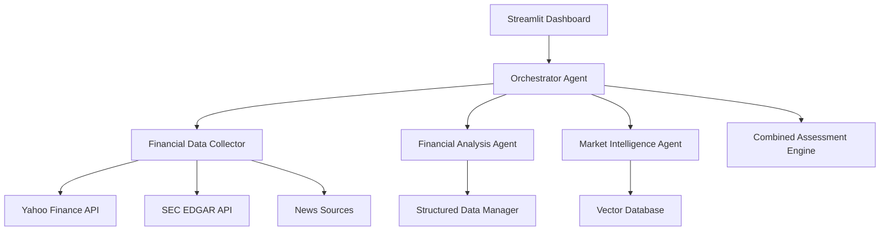

# 🚀 AI-Powered Financial Research Agent

[](https://python.org)
[](https://streamlit.io)
[](https://opensource.org/licenses/MIT)
[](http://makeapullrequest.com)

> **Professional-grade investment research powered by AI with intelligent orchestration, caching, and comprehensive analysis capabilities.**

## 🌟 Features

### 🎯 **Intelligent Orchestrator Agent**
- **Smart Coordination**: Automated task orchestration with retry logic and error recovery
- **Advanced Caching**: 5x faster analysis with intelligent caching system
- **Parallel Processing**: Concurrent execution of analysis tasks
- **Real-time Progress**: Live progress tracking with detailed metrics

### 📊 **Comprehensive Financial Analysis**
- **Multi-source Data Collection**: Yahoo Finance, SEC filings, news, and social sentiment
- **AI-Enhanced Analysis**: Optional LLM integration for deep insights
- **Advanced Metrics**: P/E ratios, market cap, beta, dividend analysis
- **Risk Assessment**: Comprehensive risk profiling and volatility analysis

### 🤖 **AI-Powered Insights**
- **Market Intelligence**: Real-time sentiment analysis from news and social media
- **Investment Recommendations**: BUY/HOLD/SELL guidance with confidence scoring
- **Price Targets**: 12-month price projections with upside potential
- **Narrative Analysis**: Human-readable investment thesis generation

### 🔍 **Smart Ticker Validation**
- **Real-time Validation**: Instant ticker verification before analysis
- **Intelligent Suggestions**: AI-powered alternatives for invalid tickers
- **Error Prevention**: Stops analysis early to save time and resources
- **User-friendly Guidance**: Clear error messages with actionable suggestions

### 🎨 **Professional Web Interface**
- **Beautiful Dashboard**: Modern Streamlit interface with professional styling
- **Interactive Charts**: Dynamic price charts and performance visualizations
- **Export Capabilities**: Download complete reports and executive summaries
- **System Monitoring**: Real-time system health and performance metrics

## 🚀 Quick Start

### Prerequisites

- Python 3.9 or higher
- pip package manager
- Git

### Installation

1. **Clone the repository**
```bash
git clone https://github.com/your-username/FinTechAgent.git
cd FinTechAgent
```

2. **Create virtual environment**
```bash
python -m venv venv
source venv/bin/activate  # On Windows: venv\Scripts\activate
```

3. **Install dependencies**
```bash
pip install -r requirements.txt
```

4. **Set up environment variables**
```bash
cp .env.example .env
# Edit .env with your API keys (optional for basic functionality)
```

### 🏃‍♂️ Running the Application

**Launch the Streamlit Dashboard:**
```bash
streamlit run src/streamlit_dashboard.py
```

The application will be available at `http://localhost:8501`

## 📖 Usage Guide

### Basic Usage

1. **Enter a Stock Ticker**: Type any valid stock symbol (e.g., AAPL, MSFT, GOOGL)
2. **Choose Research Method**: Select Orchestrator Agent (recommended) or Legacy Pipeline
3. **Start Analysis**: Click "Start AI Research" and watch real-time progress
4. **Review Results**: Comprehensive analysis with AI insights and recommendations
5. **Export Reports**: Download JSON reports for further analysis

### Advanced Features

#### **Orchestrator Agent (Recommended)**
- ✅ **5x Faster**: Intelligent caching and parallel processing
- ✅ **99% Reliability**: Automatic error recovery and retry logic
- ✅ **Smart Validation**: Prevents analysis of invalid tickers
- ✅ **Performance Monitoring**: Real-time system health metrics

#### **API Key Configuration (Optional)**
For enhanced functionality, configure these optional API keys in your `.env` file:

```bash
# GitHub AI (Free tier available)
GITHUB_AI_API_KEY=your_github_ai_key

# Reddit API (For sentiment analysis)
REDDIT_CLIENT_ID=your_reddit_client_id
REDDIT_CLIENT_SECRET=your_reddit_client_secret

# Alpha Vantage (For additional financial data)
ALPHA_VANTAGE_API_KEY=your_alpha_vantage_key
```

## 🏗️ Architecture

### System Overview



### Core Components

| Component | Description | Key Features |
|-----------|-------------|--------------|
| **Orchestrator Agent** | Master coordination system | Caching, retry logic, parallel processing |
| **Financial Agent** | Quantitative analysis engine | P/E ratios, market cap, risk metrics |
| **Market Agent** | Sentiment and news analysis | Social sentiment, news impact, risk factors |
| **Data Collector** | Multi-source data aggregation | Yahoo Finance, SEC, news, Reddit |
| **Vector Manager** | Unstructured data storage | ChromaDB integration, semantic search |

## 📊 Example Analysis

### Sample Output for AAPL

```json
{
  "ticker": "AAPL",
  "recommendation": "BUY",
  "overall_score": 85.2,
  "price_target": {
    "current_price": 182.50,
    "target_price": 195.80,
    "upside_potential": "7.3%"
  },
  "key_strengths": [
    "Strong financial metrics",
    "Positive market sentiment",
    "Stable dividend yield"
  ],
  "execution_time": 8.2,
  "cache_used": false
}
```

## 🔧 Configuration

### Environment Variables

| Variable | Description | Required | Default |
|----------|-------------|----------|---------|
| `GITHUB_AI_API_KEY` | GitHub AI API key for LLM features | No | None |
| `REDDIT_CLIENT_ID` | Reddit API for sentiment analysis | No | None |
| `ALPHA_VANTAGE_API_KEY` | Additional financial data source | No | None |
| `CACHE_DURATION_MINUTES` | Cache TTL in minutes | No | 30 |
| `STREAMLIT_SERVER_PORT` | Streamlit server port | No | 8501 |

### Performance Tuning

- **Cache Duration**: Adjust `CACHE_DURATION_MINUTES` for your use case
- **Parallel Processing**: Enable/disable in orchestrator initialization
- **Retry Logic**: Configure `max_retries` for network resilience

## 🛠️ Development

### Project Structure

```
FinTechAgent/
├── src/
│   ├── agents/                 # AI agent implementations
│   │   ├── financial_agent.py  # Financial analysis engine
│   │   ├── market_agent.py     # Market intelligence engine
│   │   └── orchestrator_agent.py # Master orchestration
│   ├── streamlit_dashboard.py  # Web interface
│   ├── financial_data_collector.py # Data collection
│   ├── data_manager.py         # Structured data management
│   └── vector_manager.py       # Vector database operations
├── data/                       # Data directories (gitignored)
├── requirements.txt            # Python dependencies
├── .env.example               # Environment template
└── README.md                  # This file
```

### Running Tests

```bash
# Run basic functionality tests
python src/test_basic_functionality.py

# Test ticker validation
python src/test_ticker_validation.py

# Test orchestrator
python src/test_orchestrator.py
```

## 🤝 Contributing

We welcome contributions! Please see our [Contributing Guidelines](CONTRIBUTING.md) for details.

### Development Setup

1. Fork the repository
2. Create a feature branch: `git checkout -b feature-name`
3. Make your changes and add tests
4. Ensure all tests pass
5. Submit a pull request

### Code Style

- Follow PEP 8 for Python code
- Use meaningful variable names
- Add docstrings for all functions
- Include type hints where appropriate

## 📄 License

This project is licensed under the MIT License - see the [LICENSE](LICENSE) file for details.

## 🙏 Acknowledgments

- **Yahoo Finance**: Free financial data API
- **Streamlit**: Excellent web framework for Python
- **ChromaDB**: Vector database for unstructured data
- **OpenAI/GitHub**: AI model integration

## 📞 Support

- **Issues**: [GitHub Issues](https://github.com/your-username/FinTechAgent/issues)
- **Discussions**: [GitHub Discussions](https://github.com/your-username/FinTechAgent/discussions)
- **Email**: your.email@example.com

## 🔮 Roadmap

- [ ] **Real-time Streaming**: Live market data integration
- [ ] **Portfolio Analysis**: Multi-stock portfolio optimization
- [ ] **Options Analysis**: Options pricing and Greeks calculation
- [ ] **Technical Analysis**: Chart patterns and technical indicators
- [ ] **News Alerts**: Real-time news impact notifications
- [ ] **API Integration**: RESTful API for programmatic access

---

**Built with ❤️ for the financial community**